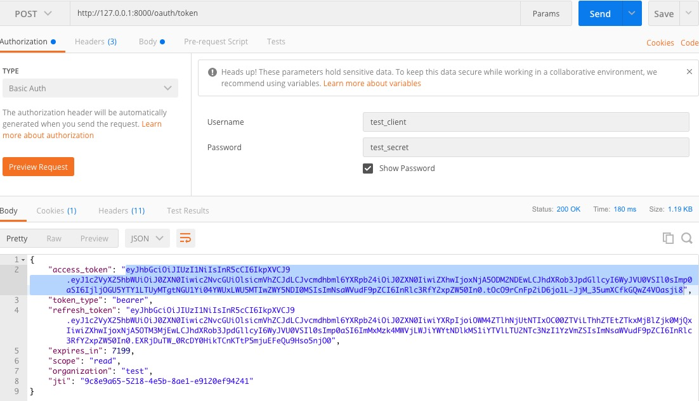

授权认证模块
---------

## 简介

采用oauth2实现授权与认证

## 架构

服务调用授权与认证时序如下


### OAuth2简介:

#### OAuth2的4种模式

客户端必须得到用户的授权（authorization grant），才能获得令牌（access token）。OAuth 2.0定义了四种授权方式。

* 密码模式（resource owner password credentials）：

* 客户端模式（client credentials）：

* 授权码模式（authorization code）：

* 简化模式（implicit）：

[具体参考阮一峰oauth博客](https://www.ruanyifeng.com/blog/2019/04/oauth-grant-types.html)

#### 密码模式
请求方式：


#### 授权码模式
1.首先进行授权，请求url如下：
```
http://127.0.0.1:8000/oauth/authorize?response_type=code&client_id=test_client&redirect_uri=http://127.0.0.1:8000/cc/ceshi&scope=read
```
跳转到登录页面


登录成功，并进行授权会重定向到设置的的url地址，然后返回code值，在请求token值即可。



