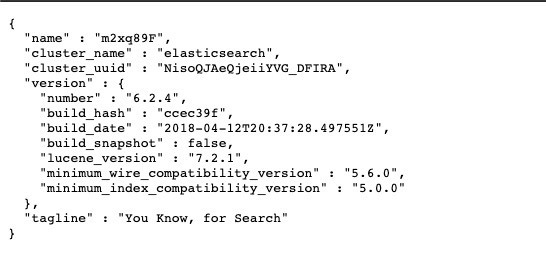

elasticsearch
----------
## 简介
Elasticsearch 是一个分布式、RESTful 风格的搜索和数据分析引擎，能够解决不断涌现出的各种用例。 作为 Elastic Stack 的核心，它集中存储您的数据，帮助您发现意料之中以及意料之外的情况。

[es官网地址](https://www.elastic.co/cn/elasticsearch/)

### 安装部署
[下载链接](https://artifacts.elastic.co/downloads/elasticsearch/elasticsearch-6.2.4.tar.gz)
下载完成之后启动命令：
```
./elasticsearch -d
```

### 验证安装成功失败
安装完成后，在浏览器输入http://ip:9200/
如果看到如下图片便是安装成功
