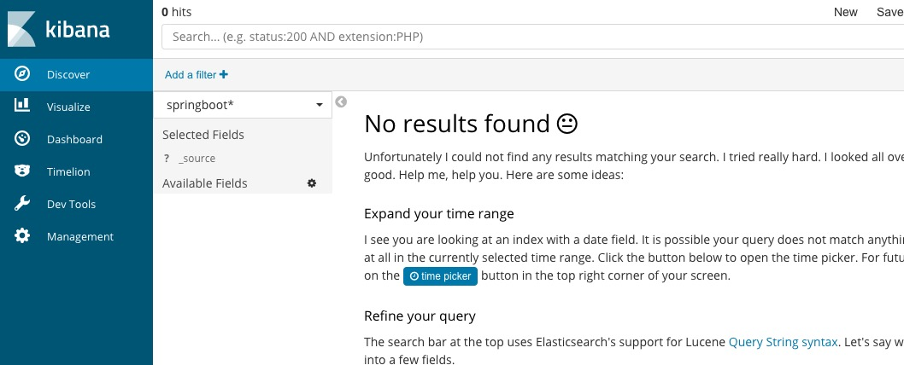

kibana
----------
## 简介
Kibana 是一个免费且开放的用户界面，能够让您对 Elasticsearch 数据进行可视化，并让您在 Elastic Stack 中进行导航。您可以进行各种操作，从跟踪查询负载，到理解请求如何流经您的整个应用，都能轻松完成。

[kibana官网地址](https://www.elastic.co/cn/kibana)

### 安装部署
[下载链接](https://www.elastic.co/cn/downloads/past-releases/kibana-6-2-4)

找到config文件夹，修改kibana.yml
```
server.host: "192.168.31.166"
elasticsearch.url: "http://ip:9200"
```
下载完成之后启动命令：
```
nohup ./kibana &
```
### 验证安装成功失败
安装完成后，在浏览器输入http://ip:5601/
如果看到如下图片便是安装成功
