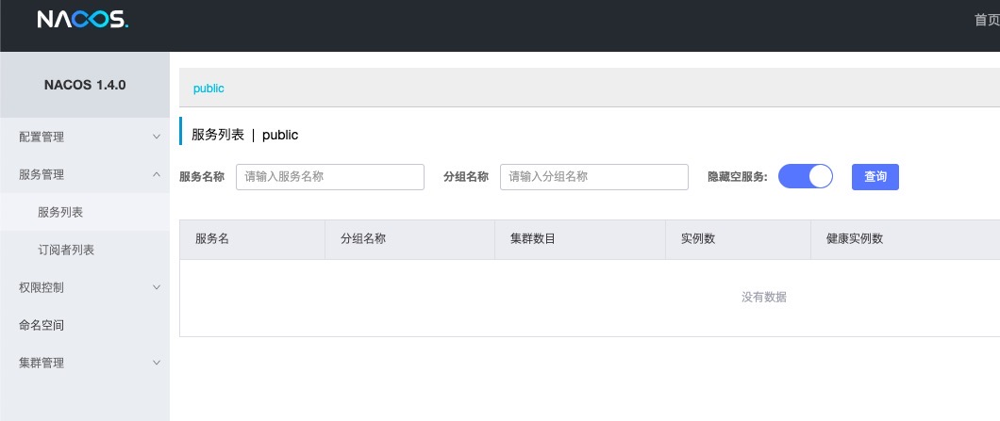

注册中心
----------
## 简介

Nacos 致力于帮助您发现、配置和管理微服务。Nacos 提供了一组简单易用的特性集，帮助您快速实现动态服务发现、服务配置、服务元数据及流量管理。

Nacos 帮助您更敏捷和容易地构建、交付和管理微服务平台。 Nacos 是构建以“服务”为中心的现代应用架构 (例如微服务范式、云原生范式) 的服务基础设施。

[Nacos官网地址](https://nacos.io/zh-cn/docs/what-is-nacos.html)

### 安装部署
[下载地址](https://github.com/alibaba/nacos/releases)

下载完成之后启动命令：
```
sh startup.sh -m standalone
```

### 验证安装成功失败
安装完成后，在浏览器输入http://ip:8848/
如果看到如下图片便是安装成功


### 基于springboot的配置
bootstrap.yml

```
spring:
  application:
    name: auth
  cloud:
    nacos:
      discovery:
        server-addr: ip:8848
        cluster-name: test2
      config:
        server-addr: ip:8848
        file-extension: yml
```

