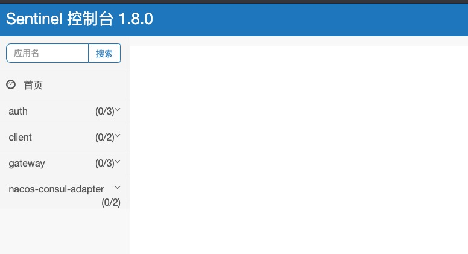

流量控制
----------
## 简介

随着微服务的流行，服务和服务之间的稳定性变得越来越重要。Sentinel 是面向分布式服务架构的流量控制组件，主要以流量为切入点，从流量控制、熔断降级、系统自适应保护等多个维度来帮助您保障微服务的稳定性。

[sentinel官网地址](https://sentinelguard.io/zh-cn/docs/introduction.html)

### 安装部署
[下载地址](https://github.com/alibaba/Sentinel/releases)

下载完成之后启动命令：
```
nohup java -Dserver.port=8718 -jar sentinel-dashboard-1.7.2.jar >sentinel.log &
```

### 验证安装成功失败
安装完成后，在浏览器输入http://ip:8718/
如果看到如下图片便是安装成功

### 基于springboot的配置
bootstrap.yml

```
spring:
  application:
    name: auth
  cloud:
    sentinel:
      transport:
        dashboard: ip:8718
      eager: true
```

