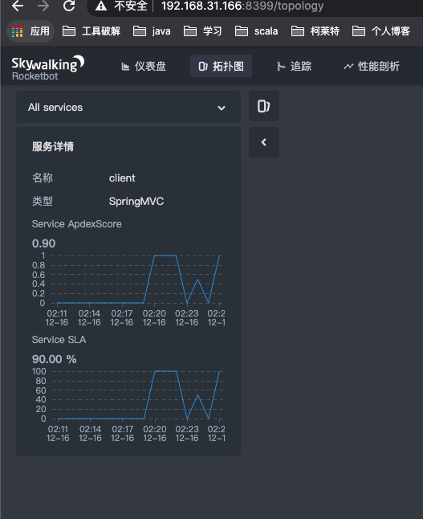

skywalking
----------
## 简介

SkyWalking是一个开源APM系统，包括对Cloud Native体系结构中的分布式系统的监视，跟踪，诊断功能。

[skywalking官网地址](https://skywalking.apache.org/)
### 安装部署
[下载链接](https://www.elastic.co/cn/downloads/past-releases/kibana-6-2-4)

找到config文件夹，修改application.yml
```
修改gRPCHost: ${SW_CORE_GRPC_HOST:127.0.0.1} 127.0.0.1修改为本机ip
选择使用elasticsearch
selector: ${SW_STORAGE:elasticsearch}
修改
clusterNodes: ${SW_STORAGE_ES_CLUSTER_NODES:ip:9200}
```
下载完成之后启动命令：
```
nohup ./kibana &
```
### 验证安装成功失败
安装完成后，在浏览器输入http://ip:skywalking.jpg/
如果看到如下图片便是安装成功


### 项目中启用skywalking
skywalking-agent.jar在下载下来的skywaling文件中的agent文件夹内。
通过启动命令进行启动skywalking客户端

```
java -javaagent:skywalking-agent.jar -Dskywalking.agent.service_name=gateway -Dskywalking.collector.backend_service=ip:11800 -jar auth-1.0-SNAPSHOT.jar
```

